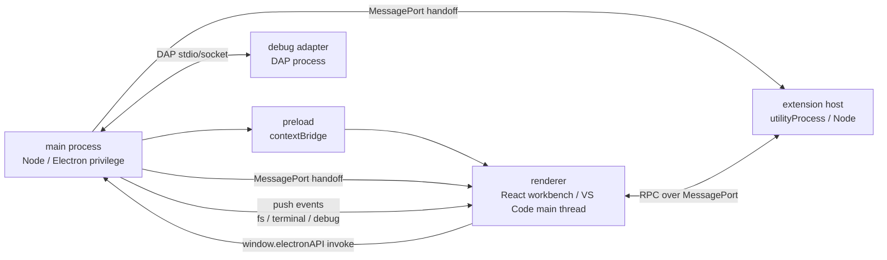

# Mini VSCode

A compact VS Code clone built for learning Electron and the architecture behind VS Code.

This project is not trying to become a full editor. Its goal is to re-create the most important desktop architecture patterns from VS Code in a smaller, readable codebase: process isolation, a secure preload bridge, renderer-side services and dependency injection, a command registry, Monaco integration, an integrated terminal, an extension host, RPC, language features, and a DAP-based debugging path.

## What This Project Is

Mini VSCode is a runnable architecture study. It deliberately keeps the VS Code mental model instead of replacing it with shortcuts that would be more typical in a small Electron app.

Core principles:

- The renderer is a sandboxed web environment and does not directly access Node or Electron APIs.
- The main process owns privileged capabilities such as the filesystem, terminal, debug adapters, app paths, and windows.
- The preload script is the only bridge into the renderer and exposes a controlled `window.electronAPI`.
- In VS Code terms, the renderer acts as the "main thread": it owns the workbench, services, commands, editor state, and extension-facing main-thread implementations.
- The extension host is an isolated Node process that talks to the renderer through MessagePort-based RPC.
- Application state lives in services and changes are pushed through `Emitter/Event`.
- User actions, keybindings, palette entries, menus, and extensions all converge on `CommandService.executeCommand(id, ...args)`.

## Implemented Learning Slices

- VS Code-like workbench layout: Activity Bar, Sidebar, Editor Area, Panel, and Status Bar.
- Workspace filesystem features: open folder, file tree, create, rename, delete, save, and file change watching.
- Monaco editor integration: tabs, reusable models, dirty state, themes, and basic language experience.
- Command system: command registration, command palette, keybinding dispatch, and a shared execution entry point.
- Renderer dependency injection: `createDecorator`, `ServiceCollection`, `InstantiationService`, and lazy singleton services.
- Integrated terminal: `node-pty` lives in the main process while the renderer only streams terminal data and sends input.
- Extension system: gallery extensions, install/uninstall, enable/disable, manifest commands, and lazy activation.
- Extension host: Electron `utilityProcess` isolation with a simplified `vscode` API.
- RPC channel: renderer and extension host communicate through a shared `RPCProtocol`.
- Language features: TypeScript diagnostics, go-to-definition, and a learning-oriented LSP-over-stdio path.
- Debugging path: renderer UI -> main `DebugService` -> DAP session -> mock or JavaScript debug adapter.
- Theme system: built-in themes, JSON theme loading, and configuration-driven theme application.

## Requirements

The project uses pnpm. The expected version is declared in `package.json`:

```bash
pnpm --version
```

Install dependencies:

```bash
pnpm install
```

The integrated terminal depends on `@homebridge/node-pty-prebuilt-multiarch`, which is rebuilt for Electron after install. Keep the `.npmrc` settings that allow install scripts to run; otherwise the terminal native module may not match Electron's ABI.

## Common Commands

Start the real Electron app with HMR:

```bash
pnpm dev
```

Build the Electron app into `out/`:

```bash
pnpm build
```

Run an Electron preview from the built output:

```bash
pnpm preview
```

Package the app with electron-builder into `dist/`:

```bash
pnpm package
```

Rebuild the terminal native dependency for Electron:

```bash
pnpm rebuild:native
```

Run TypeScript type checking:

```bash
pnpm tsc
```

There is currently no test runner or linter configured. The practical verification loop is `pnpm dev`, then checking behavior and console logs in the real Electron window. `pnpm tsc` is useful for project-wide type checks.

## Architecture Overview



### Main Process

Directory: `src/main/`

The main process owns system capabilities: windows, filesystem access, configuration, terminal processes, extension installation, debug adapter processes, and application paths. The renderer must request those capabilities through the preload bridge.

Key files:

- `src/main/index.ts`: application entry point.
- `src/main/window-manager.ts`: creates the `BrowserWindow` and configures preload and security options.
- `src/main/ipc-router.ts`: central registry for renderer-to-main IPC handlers.
- `src/main/services/file-system-service.ts`: filesystem source of truth and chokidar watcher.
- `src/main/services/terminal-service.ts`: `node-pty` terminal lifecycle.
- `src/main/extensions/extensionManagementService.ts`: gallery and installed extension management.
- `src/main/extensions/extensionHostProcess.ts`: starts the extension host and hands off the MessagePort.
- `src/main/services/debug-service.ts`: debug session entry point.
- `src/main/debug/dap-session.ts`: DAP request, response, and event handling.

### Preload

Directory: `src/preload/`

The preload script is the only safe bridge between privileged Electron APIs and the sandboxed renderer. It exposes `window.electronAPI` through `contextBridge.exposeInMainWorld`, and it forwards the extension-host MessagePort from Electron's isolated preload world into the renderer main world.

### Renderer

Directory: `src/renderer/`

The renderer is the workbench and the closest equivalent to VS Code's main thread in this project. React components handle display and interaction; durable state and behavior live in services.

Key directories:

- `src/renderer/workbench/`: workbench shell and layout.
- `src/renderer/components/`: editor, explorer, terminal, debug, command palette, notifications, and extensions UI.
- `src/renderer/services/`: editor, commands, keybindings, layout, workspace, themes, language features, diagnostics, storage, and more.
- `src/renderer/instantiation/`: VS Code-style dependency injection container.
- `src/renderer/base/event.ts`: `Emitter/Event` reactive primitive.
- `src/renderer/base/lifecycle.ts`: `IDisposable` and `DisposableStore`.
- `src/renderer/platform/bootstrap.ts`: imports singleton registration side effects and creates the root container.
- `src/renderer/workbench/contrib/registerContributions.ts`: registers built-in commands and default keybindings.

### Extension Host

Directory: `src/exthost/`

The extension host runs inside an Electron `utilityProcess` and does not directly access renderer objects. Extension code uses the simplified `vscode` API to execute commands, register language features, and show messages. Those calls flow back to renderer-side main-thread implementations through RPC.

Key files:

- `src/exthost/extensionHostMain.ts`: extension host entry point.
- `src/exthost/vscode-api.ts`: simplified `vscode` API.
- `src/exthost/extHostCommands.ts`: extension-side command registration and execution.
- `src/exthost/extHostLanguageFeatures.ts`: language feature bridge.
- `src/exthost/extHostDocuments.ts`: document synchronization.
- `src/platform/rpc/`: shared renderer and extension-host RPC protocol.

## Four VS Code Pillars

### 1. Dependency Injection

Dependencies are injected through parameter decorators:

```ts
constructor(@ICommandService private readonly commandService: ICommandService) {}
```

`ICommandService` is the TypeScript interface, the parameter decorator, and the DI token. Dependency metadata is written to a static constructor field at runtime by the decorator. The project does not rely on `reflect-metadata` or `emitDecoratorMetadata`, which keeps the pattern compatible with esbuild and electron-vite.

### 2. Services and Singleton Registration

Service modules call `registerSingleton()` as an import side effect. `src/renderer/platform/bootstrap.ts` imports those modules, collects the singleton descriptors, and builds the root `InstantiationService`.

When adding a service, do both:

1. Register it with `registerSingleton(IServiceId, ServiceImpl)`.
2. Import the service module in `src/renderer/platform/bootstrap.ts`.

Without the import, the registration side effect never runs.

### 3. Emitter/Event State

State lives inside services. When state changes, a service calls `fire()` on an `Emitter`. React components subscribe with `useService` and `useEvent`, then read the fresh state from the service.

`useEvent` selectors must be reference-stable when nothing changes. Prefer:

```ts
useEvent(service.onDidChangeTabs, () => service.tabs)
```

Avoid:

```ts
useEvent(service.onDidChangeTabs, () => [...service.tabs])
```

The second form creates a new array each time and can cause an infinite render loop.

### 4. Command Registry

Command ids are the middle currency of the app. Keybindings, command palette entries, menus, and extensions only need command ids. Implementations register handlers with `CommandService`.

The shared execution entry point is:

```ts
commandService.executeCommand(id, ...args)
```

This lets built-in commands and extension commands share the same execution path.

## Extensions

```text
extensions/  # Built-in extensions shipped with the app
gallery/     # Installable sample extensions shown in the Extensions view
```

Sample extensions include:

- `word-count`
- `insert-date`
- `emoji-log`
- `ts-language-features`
- `ts-lsp`

In development, built-in extensions are loaded from the repository's `extensions/` directory. In packaged builds, built-in extensions and gallery extensions are copied as extra resources. User-installed extensions are written to `app.getPath('userData')/extensions`, avoiding writes into read-only packaged app resources.

## Debugging System

The debug stack follows the same broad layering as VS Code:

```text
DebugView / DebugService(renderer)
  -> window.electronAPI.debug
  -> DebugService(main)
  -> DAPSession
  -> debug adapter
```

The renderer owns UI state, breakpoint display, and command entry points. The main process starts adapters, owns the DAP transport, and forwards DAP events back to the renderer.

## Browser Preview Mock

`src/renderer/mocks/electron-api-mock.ts` provides a browser-only mock for `window.electronAPI`. It is useful when previewing the renderer without Electron. The mock simulates filesystem, terminal, configuration, state, and extension APIs.

The real Electron app gets the real `window.electronAPI` from preload, and the mock does not overwrite it.

## Project Structure

```text
.
├── docs/                 # Architecture notes and focused implementation docs
├── extensions/           # Built-in extensions
├── gallery/              # Installable sample extensions
├── scripts/              # Helper scripts
├── src/
│   ├── main/             # Electron main process
│   ├── preload/          # contextBridge bridge
│   ├── renderer/         # React workbench and VS Code main-thread services
│   ├── exthost/          # Extension host entry and simplified vscode API
│   └── platform/rpc/     # Renderer <-> extension host RPC
├── electron.vite.config.ts
├── vite.preview.config.ts
└── package.json
```

## Suggested Reading Order

If you are reading this project to learn the architecture, start here:

1. `docs/architecture-notes.md`
2. `docs/di-and-decorators.md`
3. `src/main/window-manager.ts`
4. `src/preload/index.ts`
5. `src/renderer/platform/bootstrap.ts`
6. `src/renderer/services/commands/commandService.ts`
7. `src/renderer/services/editor/editorService.ts`
8. `src/main/extensions/extensionHostProcess.ts`
9. `src/exthost/extensionHostMain.ts`
10. `src/platform/rpc/rpcProtocol.ts`
11. `src/main/services/debug-service.ts`
12. `src/main/debug/dap-session.ts`

For packaging paths and native module issues, continue with:

- `docs/packaged-paths-and-extensions.md`
- `docs/node-pty-native-build.md`

## Common Pitfalls

### The renderer cannot import Node modules directly

Do not import `fs`, `node-pty`, or Electron main-process APIs from `src/renderer/**`. The renderer can only use capabilities exposed through `window.electronAPI`.

### Passing build is not the same as running correctly

Several issues in this project only appear at runtime:

- Whether DI parameter decorators were transformed correctly by esbuild.
- Whether React was deduped, otherwise Allotment can throw an invalid hook call.
- Whether Allotment measured panel sizes after mount.
- Whether the `node-pty` native ABI matches Electron.
- Whether the extension-host MessagePort handoff completed.

### Terminal native ABI mismatch

If terminal startup fails with a `NODE_MODULE_VERSION` or ABI mismatch error, run:

```bash
pnpm rebuild:native
```

If it still fails, see `docs/node-pty-native-build.md`.

### A new service does not work

Check whether its module is imported from `src/renderer/platform/bootstrap.ts`. Calling `registerSingleton()` in a file is not enough unless that file is imported.

### `useEvent` causes infinite rendering

Check whether the selector creates a new reference every time. Return stable service-owned references when no state has changed.

## Reference Docs

- `docs/architecture-notes.md`: architecture thread and the key learning points.
- `docs/di-and-decorators.md`: command decoupling and VS Code-style DI.
- `docs/node-pty-native-build.md`: native terminal module build and troubleshooting.
- `docs/packaged-paths-and-extensions.md`: development versus production paths and extension directory design.
