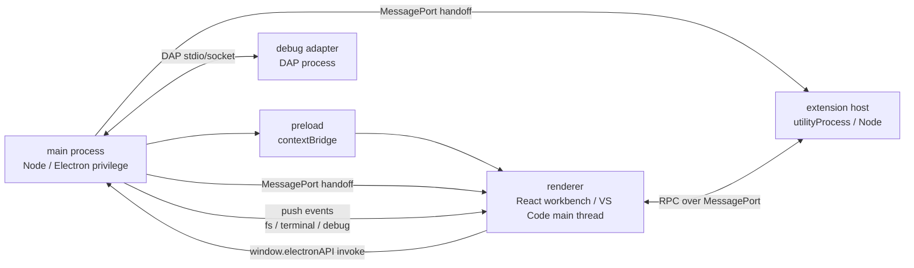

# Mini VSCode

一个用于学习 Electron 与 VS Code 内部架构的 mini VSCode 克隆。

这个项目的目标不是做一个功能完整的编辑器，而是把 VS Code 桌面端最关键的工程骨架用更小的代码量复刻出来：多进程隔离、preload 安全桥、renderer 侧服务/DI、命令系统、Monaco 编辑器、终端、扩展宿主、RPC、语言能力和 DAP 调试链路。

## 项目定位

Mini VSCode 更像一份可运行的架构学习材料。它刻意保留 VS Code 的心智模型，而不是把事情改成普通 Electron App 里更直接的写法。

核心原则：

- renderer 是受限的 Web 环境，不直接访问 Node/Electron 能力。
- main 进程拥有文件系统、终端、调试适配器和窗口等特权能力。
- preload 是唯一安全桥，向 renderer 暴露 `window.electronAPI`。
- renderer 在 VS Code 语义里扮演 main thread，持有 workbench、service、command、editor state。
- extension host 是独立 Node 进程，通过 MessagePort + RPC 与 renderer 通信。
- 业务状态放在 service 里，通过 `Emitter/Event` 推送变化，再由 React 投影到 UI。
- 所有入口最终收敛到 `CommandService.executeCommand(id, ...args)`。

## 已实现的学习切片

- 类 VS Code 工作台布局：Activity Bar、Sidebar、Editor Area、Panel、Status Bar。
- 文件工作区：打开文件夹、文件树、创建、重命名、删除、保存、文件变化监听。
- Monaco 编辑器：tab、model 复用、dirty 状态、主题切换、基础语言体验。
- 命令系统：命令注册、命令面板、快捷键分发、统一 `executeCommand` 入口。
- renderer DI 容器：`createDecorator`、`ServiceCollection`、`InstantiationService`、懒实例化。
- 集成终端：main 进程持有 `node-pty`，renderer 只接收终端数据流并发送输入。
- 扩展系统：gallery、安装/卸载/启用/禁用、manifest commands、lazy activation。
- 扩展宿主：Electron `utilityProcess` 隔离运行扩展代码，并提供简化版 `vscode` API。
- RPC 通道：renderer 与 extension host 通过共享 `RPCProtocol` 双向调用。
- 语言能力：TypeScript diagnostics、go-to-definition，以及 LSP over stdio 的学习版本。
- 调试链路：renderer UI -> main `DebugService` -> DAP session -> mock/JS debug adapter。
- 主题系统：内置主题、JSON 主题加载、设置项驱动主题应用。

## 运行环境

项目使用 pnpm，版本写在 `package.json`：

```bash
pnpm --version
```

安装依赖：

```bash
pnpm install
```

注意：项目依赖 `@homebridge/node-pty-prebuilt-multiarch` 作为终端 native 模块，安装后会通过 `postinstall` 执行 rebuild。不要删除 `.npmrc` 里的 `ignore-scripts=false` 和 `approve-builds[]` 配置，否则终端模块可能无法按 Electron ABI 正确构建。

## 常用命令

```bash
pnpm dev
```

启动真实 Electron 应用。main、preload、renderer 都走 electron-vite 开发链路，适合验证完整行为。

```bash
pnpm build
```

构建产物到 `out/`：

- `out/main`
- `out/preload`
- `out/renderer`

```bash
pnpm preview
```

运行 electron-vite preview，用构建后的 Electron 产物预览应用。

```bash
pnpm package
```

使用 electron-builder 打包，产物输出到 `dist/`。

```bash
pnpm rebuild:native
```

重新编译 `node-pty` 相关 native 依赖。如果启动时报 `NODE_MODULE_VERSION` 或 ABI 不匹配，先运行这个命令。

```bash
pnpm tsc
```

执行 TypeScript 类型检查。当前项目没有配置测试框架和 lint，主要验证方式是 `pnpm dev` 后在真实 Electron 窗口中检查行为和控制台日志。

## 架构总览



### main

目录：`src/main/`

main 进程拥有系统能力：窗口、文件系统、配置、终端、扩展安装、调试适配器进程、应用路径。renderer 不能绕过 preload 直接调用这些能力。

关键文件：

- `src/main/index.ts`：应用启动入口。
- `src/main/window-manager.ts`：创建 BrowserWindow，配置 preload 和安全选项。
- `src/main/ipc-router.ts`：集中注册 renderer -> main 的 IPC handler。
- `src/main/services/file-system-service.ts`：文件系统真相与 chokidar 监听。
- `src/main/services/terminal-service.ts`：`node-pty` 终端生命周期。
- `src/main/extensions/extensionManagementService.ts`：扩展 gallery 与安装目录管理。
- `src/main/extensions/extensionHostProcess.ts`：启动 extension host 并交接 MessagePort。
- `src/main/services/debug-service.ts`：调试会话入口。
- `src/main/debug/dap-session.ts`：DAP 请求、响应和事件处理。

### preload

目录：`src/preload/`

preload 是主进程能力进入 renderer 的唯一桥。它通过 `contextBridge.exposeInMainWorld` 暴露 `window.electronAPI`，renderer 侧只拿到受控的异步 API。

这里也负责把 main 交给 preload 的 extension-host MessagePort 再转发到 renderer 主世界。

### renderer

目录：`src/renderer/`

renderer 是工作台主体，也是本项目最接近 VS Code main thread 的地方。React 组件只负责展示和交互，状态与行为主要沉在 service 里。

关键目录：

- `src/renderer/workbench/`：工作台布局。
- `src/renderer/components/`：编辑器、资源管理器、终端、调试、扩展视图等 UI。
- `src/renderer/services/`：编辑器、命令、快捷键、布局、工作区、主题、语言能力等服务。
- `src/renderer/instantiation/`：VS Code 风格 DI 容器。
- `src/renderer/base/event.ts`：`Emitter/Event` 响应式基础。
- `src/renderer/base/lifecycle.ts`：`IDisposable` 与 `DisposableStore`。
- `src/renderer/platform/bootstrap.ts`：导入 singleton 注册副作用并创建根容器。
- `src/renderer/workbench/contrib/registerContributions.ts`：注册内置命令与默认快捷键。

### extension host

目录：`src/exthost/`

extension host 运行在 Electron `utilityProcess` 中，不直接访问 renderer 内部对象。扩展代码通过简化版 `vscode` API 调用命令、注册语言能力、发送消息，最终经 RPC 回到 renderer 的 main-thread 实现。

关键文件：

- `src/exthost/extensionHostMain.ts`：扩展宿主入口。
- `src/exthost/vscode-api.ts`：简化版 `vscode` API。
- `src/exthost/extHostCommands.ts`：扩展侧命令注册与执行。
- `src/exthost/extHostLanguageFeatures.ts`：扩展侧语言能力桥。
- `src/exthost/extHostDocuments.ts`：文档同步。
- `src/platform/rpc/`：renderer 与 extension host 共享的 RPC 协议实现。

## VS Code 四个核心支柱

### 1. DI 容器

依赖通过参数装饰器注入：

```ts
constructor(@ICommandService private readonly commandService: ICommandService) {}
```

`ICommandService` 同时是 TypeScript interface、参数装饰器和 DI token。依赖信息由装饰器运行时写到构造函数静态字段，不依赖 `reflect-metadata`，也不需要 `emitDecoratorMetadata`。

这正是本项目能在 esbuild/electron-vite 下使用 VS Code 风格 DI 的原因。

### 2. Service + singleton 注册

service 模块通过 `registerSingleton()` 注册自己。`platform/bootstrap.ts` 导入这些模块，让注册副作用发生，再从 `getSingletonServiceDescriptors()` 构造根 `InstantiationService`。

新增 service 时要同时做两件事：

1. 在 service 文件里 `registerSingleton(IServiceId, ServiceImpl)`。
2. 在 `src/renderer/platform/bootstrap.ts` 导入该 service 文件。

### 3. Emitter/Event 响应式状态

状态放在 service 内部。状态变化后 service `fire()` 一个事件，React 组件用 `useService` + `useEvent` 订阅，再读取最新状态。

注意 `useEvent` 的 selector 必须在无变化时返回同一个引用。例如返回 `service.tabs`，不要返回 `[...service.tabs]`，否则会导致无限重渲染。

### 4. Command registry

命令 id 是中间货币。快捷键、命令面板、菜单、扩展都只需要知道 command id，实现方把 handler 注册给 `CommandService`。

执行入口统一为：

```ts
commandService.executeCommand(id, ...args)
```

这样内置命令与扩展命令可以共享同一条执行链。

## 扩展目录

```text
extensions/  # 内置扩展，随应用发布
gallery/     # 可安装扩展市场，供 Extensions 视图安装
```

当前示例扩展包括：

- `word-count`
- `insert-date`
- `emoji-log`
- `ts-language-features`
- `ts-lsp`

开发态下，内置扩展来自项目根目录的 `extensions/`。生产包里，内置扩展和 gallery 会作为 extra resources 放到应用资源目录；用户安装扩展写入 `app.getPath('userData')/extensions`，避免写入只读的 `app.asar`。

## 调试系统

调试能力按 VS Code 的分层来理解：

```text
DebugView / DebugService(renderer)
  -> window.electronAPI.debug
  -> DebugService(main)
  -> DAPSession
  -> debug adapter
```

renderer 负责 UI 状态、断点展示和命令入口；main 负责启动 adapter、维护 DAP transport、转发 DAP event。这样 renderer 仍然保持沙箱化，不直接 spawn 进程。

## 浏览器预览 mock

`src/renderer/mocks/electron-api-mock.ts` 提供了浏览器环境下的 `window.electronAPI` mock，用于不启动 Electron 时预览 renderer UI。它会模拟文件系统、终端、配置、状态、扩展列表等能力。

真实 Electron 运行时由 preload 注入真正的 `window.electronAPI`，mock 不会覆盖它。

## 项目结构

```text
.
├── docs/                 # 中文架构笔记与专题文档
├── extensions/           # 内置扩展
├── gallery/              # 可安装扩展示例
├── scripts/              # 辅助脚本
├── src/
│   ├── main/             # Electron main 进程
│   ├── preload/          # contextBridge 安全桥
│   ├── renderer/         # React workbench 与 VS Code main-thread 侧服务
│   ├── exthost/          # 扩展宿主进程入口与简化 vscode API
│   └── platform/rpc/     # renderer <-> extension host RPC
├── electron.vite.config.ts
├── vite.preview.config.ts
└── package.json
```

## 推荐阅读顺序

如果你是为了学习 VS Code 架构，可以按这个顺序读：

1. `docs/architecture-notes.md`
2. `docs/di-and-decorators.md`
3. `src/main/window-manager.ts`
4. `src/preload/index.ts`
5. `src/renderer/platform/bootstrap.ts`
6. `src/renderer/services/commands/commandService.ts`
7. `src/renderer/services/editor/editorService.ts`
8. `src/main/extensions/extensionHostProcess.ts`
9. `src/exthost/extensionHostMain.ts`
10. `src/platform/rpc/rpcProtocol.ts`
11. `src/main/services/debug-service.ts`
12. `src/main/debug/dap-session.ts`

主题、打包路径、native 模块问题可以继续读：

- `docs/theme-system-roadmap.md`
- `docs/theme-plans.md`
- `docs/packaged-paths-and-extensions.md`
- `docs/node-pty-native-build.md`

## 常见坑

### renderer 不能直接 import Node 模块

不要在 `src/renderer/**` 中直接 `import fs from 'fs'` 或使用 Electron main-only API。renderer 只能通过 `window.electronAPI` 请求 main 暴露的能力。

### 编译通过不等于运行正确

这个项目里不少问题只在运行时暴露，例如：

- DI 参数装饰器是否被 esbuild 正确处理。
- React 是否被 dedupe，否则可能出现 invalid hook call。
- Allotment 初始尺寸测量是否正确。
- `node-pty` native ABI 是否匹配 Electron。
- extension host 的 MessagePort 是否已完成交接。

### native 终端模块 ABI 不匹配

如果终端相关功能启动失败，优先尝试：

```bash
pnpm rebuild:native
```

如果仍然失败，参考 `docs/node-pty-native-build.md`。

### 新增 service 后没有生效

确认 service 文件是否被 `src/renderer/platform/bootstrap.ts` 导入。只写 `registerSingleton()` 但没有导入模块，注册副作用不会执行。

### `useEvent` 无限渲染

检查 selector 是否每次都创建新引用。稳定写法：

```ts
useEvent(service.onDidChangeTabs, () => service.tabs)
```

危险写法：

```ts
useEvent(service.onDidChangeTabs, () => [...service.tabs])
```

## 参考文档

- `docs/architecture-notes.md`：项目架构主线与 10 个关键学习点。
- `docs/di-and-decorators.md`：命令解耦与 VS Code 风格 DI。
- `docs/node-pty-native-build.md`：native 终端模块构建与排错。
- `docs/packaged-paths-and-extensions.md`：开发/生产路径差异与扩展目录设计。
- `docs/theme-system-roadmap.md`：主题系统实现路线。
- `docs/theme-plans.md`：主题系统阶段计划。

